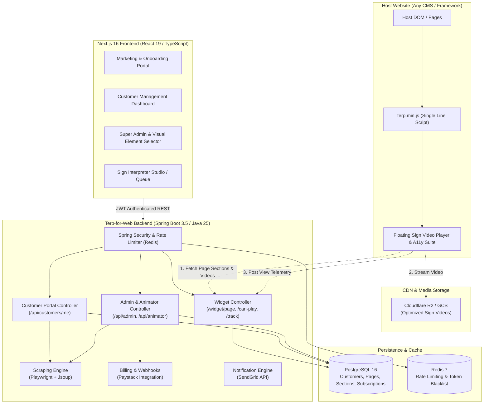
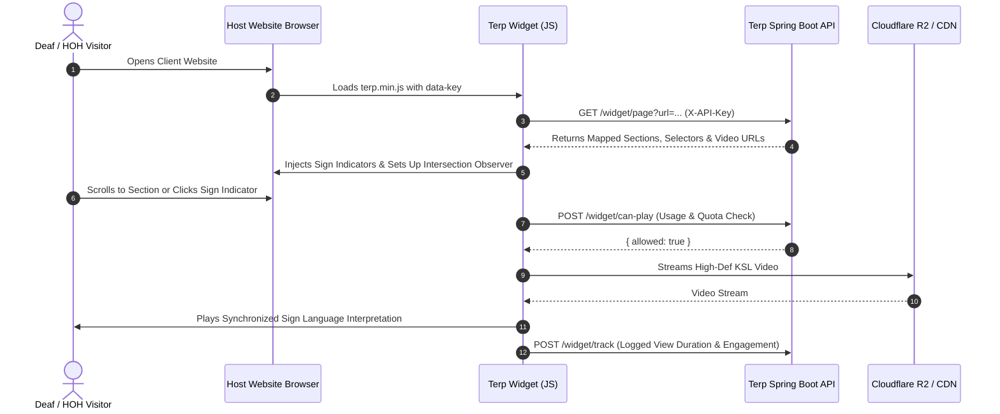

# 🤟 Signvrse Terp for Web (Terp-Web)
### *Next-Generation Web Accessibility & Sign Language Video Interpretation Platform*

[](LICENSE)
[](https://openjdk.org/)
[](https://spring.io/projects/spring-boot)
[](https://nextjs.org/)
[](https://react.dev/)
[](https://www.typescriptlang.org/)
[](https://www.w3.org/WAI/standards-guidelines/wcag/)

---

## 📌 Executive Summary

**Signvrse Terp for Web** is an enterprise-grade digital accessibility ecosystem that breaks communication barriers on the internet. By combining **intelligent DOM scanning**, **viewport-synchronized sign language interpretation (Kenyan Sign Language / KSL & International Sign)**, and a **comprehensive digital accessibility suite**, Terp-Web transforms standard websites into inclusive digital spaces for the Deaf and Hard-of-Hearing (D/HH) community—all through a single line of JavaScript.

Website owners can onboard their domain, visually select and map content sections, and have certified sign language interpreters record synchronized video translations. End-users experience smooth, non-intrusive, interactive video overlays that automatically follow page scroll, respond to user gestures, and adapt to individual accessibility needs (dyslexia fonts, contrast controls, text-to-speech, and voice dictation).

---

## 🎯 The Problem & Social Impact

```
┌────────────────────────────────────────────────────────────────────────────────────────┐
│  466M+ People Worldwide with Disabling Hearing Loss                                    │
│  Sign Language is often their FIRST & NATURAL language (text is a secondary language) │
│  < 3% of global websites offer native sign language accessibility                     │
└────────────────────────────────────────────────────────────────────────────────────────┘
```

* **Cognitive Barrier**: For many culturally Deaf individuals, written text is a second language with different syntactic and grammatical rules compared to native sign languages.
* **Legal & Regulatory Compliance**: Global legislation (e.g., European Accessibility Act 2025, US Section 508, ADA Title III, and Kenya Persons with Disabilities Act) increasingly mandates barrier-free digital access.
* **Frictionless Inclusion**: Traditional website accessibility tools only offer basic color inversion or machine text-to-speech, completely omitting the Deaf community. **Terp-Web bridges this critical divide.**

---

## 🌟 Key Platform Features

### 1. 🪟 Interactive Client Widget (`/widget`)
* **Zero-Dependency & Ultra-Lightweight**: Built with TypeScript and bundled via `esbuild` into an optimized distribution (~25KB gzipped) with zero external runtime dependencies.
* **Draggable & Resizable Avatar Panel**: Users can freely reposition, collapse, expand, or adjust the video player window anywhere on screen.
* **Smart DOM & Viewport Synchronization**: Leverages `IntersectionObserver` and `MutationObserver` to automatically highlight content sections, reveal sign language indicator icons, and queue relevant interpretation videos as users navigate.
* **Touch & Gesture Recognition**: Integrated touch gestures (e.g., swipe right on target elements) to trigger instant sign interpretation on mobile and tablet devices.
* **Full-Spectrum Accessibility Toolbar**:
  * 🔤 **Dyslexia-Friendly Typography** (OpenDyslexic style adjustments)
  * 🌓 **Contrast & Color Tools**: High contrast, invert colors, grayscale, dark mode
  * 🔍 **Visual Guides**: Text scaling (100%–150%), line-height, letter-spacing, large cursor, and reading mask
  * 🗣️ **Voice Tools**: Built-in Web Speech API Text-to-Speech (TTS VoiceOver) and speech-to-text Voice Dictation

### 2. 🔍 Automated Visual Scanner & Route Detection (`/backend` + `/dashboard`)
* **Dual-Engine Web Scraper**: Powered by **Jsoup** (for ultra-fast static HTML analysis) and **Playwright (Headless Chromium)** (for JavaScript-heavy, client-rendered SPAs).
* **Automated Route Discovery**: Crawls target domains and sitemaps to detect available routes, pages, and headings automatically.
* **Interactive Visual Bounding Box Tool**: Administrative dashboard lets teams inspect full-page screenshots, filter DOM nodes by tag (`H1`–`H6`, `P`, `LI`, `BUTTON`, `IMG`), and draw custom bounding boxes for targeted video translations.

### 3. 🎬 End-to-End Recording & Studio Management
* **Interpreter / Animator Workspace**: Dedicated recording queues showing pending, in-progress, and completed script sections.
* **Multi-Cloud Video Pipeline**: Direct integration with **Cloudflare R2** (S3-compatible API with zero egress fees), **Google Cloud Storage (GCS)**, or local storage.
* **Status Lifecycles**: Strict state management (`pending` ➔ `recording` ➔ `ready`) ensuring zero broken links in production.

### 4. 🏢 Business Portal & Enterprise Billing
* **Self-Service Dashboard**: Client management of pages, API keys, widget customization (placement, branding colors, theme).
* **Tiered Subscription Engine**: Integration with **Paystack** for monthly/annual recurring billing, automatic tier synchronization, setup fee handling, and view-based overage tracking.
* **Real-time Telemetry & Analytics**: Session tracking, section watch durations, engagement metrics, and monthly view limits.
* **System-wide Broadcast & Alerts**: Global banner notification system and SendGrid transactional/broadcast email infrastructure.

---

## 🏛️ System Architecture



---

## 🔄 User & Data Flow



---

## 💻 Tech Stack & Infrastructure

| Layer | Technologies | Description |
| :--- | :--- | :--- |
| **Backend API** | **Java 25, Spring Boot 3.5.3** | High-performance reactive and REST controllers, Spring Data JPA, Spring Security |
| **Web Crawling** | **Microsoft Playwright, Jsoup** | Headless browser page scanning, bounding-box coordinate detection, full-page screenshots |
| **Database** | **PostgreSQL 16** | Relational schemas with UUIDs, JSONB metadata, foreign-key indexing |
| **Caching & Security** | **Redis 7, Asymmetric RSA-256 JWT** | Sub-millisecond rate-limiting, session revocation, token blacklisting |
| **Frontend Portal** | **Next.js 16.1.3, React 19, TypeScript** | Responsive web dashboard, Server & Client Components, CSS design system |
| **Embed Widget** | **TypeScript, esbuild, CSS Tokens** | Zero-dependency standalone JavaScript library (< 30KB bundle) |
| **Video Storage** | **Cloudflare R2 / AWS S3 SDK / Google Cloud Storage** | Fast global delivery with zero egress costs |
| **Payments** | **Paystack API** | Recurring subscription plans, webhook handlers, local currency (KES) checkout |
| **Communications** | **SendGrid API** | Automated transactional emails, verification links, broadcast announcements |
| **Containers** | **Docker & Docker Compose** | Multi-stage Dockerfiles with Playwright dependencies pre-configured |

---

## 📂 Repository Structure

```
terp-for-web/
├── .env.example                 # Environment variable templates
├── docker-compose.yml           # Local PostgreSQL 16 & Redis 7 stack
├── test.html                    # Standalone client simulation testing page
├── backend/                     # Spring Boot Application (Java 25)
│   ├── Dockerfile               # Production multi-stage container build with Playwright
│   ├── pom.xml                  # Maven configuration & dependencies
│   └── src/main/
│       ├── java/com/signvrse/terp/
│       │   ├── admin/           # Admin overview, user management, and animator controller
│       │   ├── analytics/       # Usage tracking & telemetry services
│       │   ├── auth/            # JWT authentication, Google OAuth, password reset
│       │   ├── billing/         # Paystack subscriptions, plans, webhooks
│       │   ├── common/          # Global exception handling, rate limiting, security filters
│       │   ├── content/         # Page/Section models, scraping service, cloud storage
│       │   ├── customer/        # Customer self-service endpoints & route detection
│       │   ├── notification/    # SendGrid email service & system alert banners
│       │   └── widget/          # Public-facing embed API endpoints
│       └── resources/
│           ├── application.yml  # Application properties & profiles
│           ├── schema.sql       # PostgreSQL DDL table definitions
│           └── data.sql         # Default subscription plan seeding
├── dashboard/                   # Next.js 16 Web Dashboard
│   ├── Dockerfile               # Node.js alpine standalone production build
│   ├── package.json             # Next.js, React 19, TypeScript dependencies
│   └── src/
│       ├── app/
│       │   ├── admin/           # Super Admin portal (Revenue, Clients, Recordings, Visual Scanner)
│       │   ├── dashboard/       # Client portal (Pages, Embed Code, Analytics, Billing)
│       │   ├── login/           # Authentication UI
│       │   └── page.tsx         # Modern landing page & feature showcase
│       ├── components/          # Reusable UI components (Visual Selection Overlay, Video Uploader, etc.)
│       └── lib/                 # API client, auth wrappers, currency conversion
└── widget/                      # Embeddable Client JavaScript Library
    ├── package.json             # TypeScript & esbuild configuration
    ├── build.js                 # Production bundle compiler
    ├── dist/                    # Compiled widget artifacts (widget.min.js)
    └── src/
        ├── widget.ts            # Entry point & auto-initialization
        ├── ui.ts                # Widget floating panel, layout & accessibility toolbar
        ├── matcher.ts           # IntersectionObserver & DOM element selector matcher
        ├── gestures.ts          # Touch & swipe gesture detection
        ├── player.ts            # HTML5 video player controller & event tracking
        ├── panel-drag.ts        # Draggable and resizable panel logic
        └── styles.css           # Self-contained isolated CSS styling
```

---

## ⚡ Quickstart & Setup Guide

### 1. Prerequisites
* **Docker & Docker Compose**
* **Java 25 JDK** (Eclipse Temurin recommended)
* **Node.js 20+** & **npm**

### 2. Clone & Environment Configuration
```bash
# Clone the repository
git clone https://github.com/signvrse/terp-for-web.git
cd terp-for-web

# Setup environment variables
cp .env.example .env
```

Generate an RSA 2048-bit keypair for JWT token signing:
```bash
# Generate private key
openssl genrsa 2048 | base64

# Generate public key
openssl rsa -in private.pem -pubout | base64
```
Update `JWT_PRIVATE_KEY` and `JWT_PUBLIC_KEY` inside `.env`.

### 3. Launch Database & Cache
```bash
docker-compose up -d
```
* PostgreSQL running on port `5433` (Database: `terp_db`)
* Redis running on port `6379`

### 4. Build & Run the Backend API
```bash
cd backend
./mvnw clean spring-boot:run
```
The API server will initialize on `http://localhost:8080`.

### 5. Build the Embeddable Widget
```bash
cd ../widget
npm install
npm run build
```
This produces `widget/dist/widget.min.js`.

### 6. Run the Dashboard & Landing App
```bash
cd ../dashboard
npm install
npm run dev
```
Open [http://localhost:3000](http://localhost:3000) in your browser.

---

## 🧪 Testing the Widget Locally

You can test the embeddable widget immediately without configuring a live website using the included `test.html` sandbox:

1. Serve the project root using any local static web server:
   ```bash
   npx serve . -p 3001
   ```
2. Navigate to `http://localhost:3001/test.html`.
3. Scroll through the page to observe:
   * Automatic hand indicator icons appearing beside headings.
   * Floating video panel showing synchronized sign language interpretations.
   * Draggable and resizable video panel interactions.
   * Accessibility toolbar modifications (Dyslexia font, color inversion, contrast, etc.).

---

## 🔌 Easy 1-Line Integration

To deploy Signvrse Terp on any production website, simply paste the snippet before the closing `</body>` tag:

```html
<!-- Signvrse Terp for Web Accessibility & Sign Language Overlay -->
<script
  src="https://cdn.signvrse.com/widget/v1/widget.min.js"
  data-key="YOUR_CUSTOMER_API_KEY"
  data-position="bottom-right"
  data-highlight-color="#ff7a00"
  async>
</script>
```

### Configurable Attributes
| Attribute | Type | Default | Description |
| :--- | :--- | :--- | :--- |
| `data-key` | `string` | *Required* | Unique client API key generated from the customer dashboard |
| `data-api` | `string` | `https://api.signvrse.com` | Terp backend API base URL |
| `data-position` | `string` | `bottom-right` | Initial floating avatar location (`bottom-right` or `bottom-left`) |
| `data-theme` | `string` | `dark` | Default widget color theme (`dark` or `light`) |
| `data-highlight-color`| `string`| `#ff7a00` | Accent color for active interpreted section outlines |
| `data-logo` | `string` | Optional | Custom branding logo URL displayed inside the widget header |

---

## 🔒 Security, Compliance & Performance

* **Asymmetric RSA JWT Authentication**: API authentication utilizes private-key signed tokens with short lifespans (15 min) and rolling refresh tokens with Redis revocation.
* **Origin & Referer Domain Validation**: Widget endpoints enforce strict HTTP `Origin` and `Referer` domain checks to prevent unauthorized API key spoofing on foreign domains.
* **Tiered Rate Limiting**: Built-in Redis token bucket rate limiting per IP address and API key protects against scrapers and DDoS attempts.
* **Non-Blocking Lazy Loading**: Video media assets and iframe components are loaded strictly on demand, ensuring zero penalty on host website Lighthouse / Core Web Vitals performance scores.
* **Data Privacy**: No Personally Identifiable Information (PII) of deaf end-users is tracked; analytics only record aggregated viewport interactions and playback completions.

---

## 🗺️ Product Roadmap

- [x] **Phase 1: Core Foundation** — Multi-tenant architecture, Jsoup/Playwright visual scraper, embeddable widget, Paystack billing.
- [x] **Phase 2: Accessibility Suite** — OpenDyslexic font engine, voiceover text-to-speech, speech dictation, visual filters.
- [ ] **Phase 3: AI-Assisted Translation** — Automatic generation of 3D animated Sign Language avatars for instant real-time translation of dynamic website updates.
- [ ] **Phase 4: Multi-Dialect Support** — Expand native video interpretation datasets across ASL (American Sign Language), BSL (British Sign Language), and ISL (International Sign Language).
- [ ] **Phase 5: Native Mobile SDKs** — React Native, Flutter, iOS (Swift), and Android (Kotlin) SDKs for mobile app integration.

---

## 👥 Project Team & Contact

**Signvrse Terp for Web** is designed and maintained by the Signvrse engineering and accessibility team.

* 🌐 **Website**: [https://signvrse.com](https://signvrse.com)
* 📧 **Inquiries & Partnerships**: [sales@signvrse.com](mailto:sales@signvrse.com)
* 💬 **Support**: [support@signvrse.com](mailto:support@signvrse.com)

---
*Empowering a more accessible, inclusive, and connected web for all.* 🌍🤟
